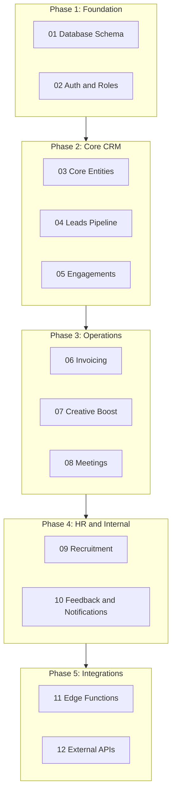

# Meta-Plan: Socials CRM Supabase Implementation

This is the master plan for implementing the complete Supabase backend for Socials CRM.

---

## Phase Overview

---

## Sub-Plans

| # | Name | File | Status |
|---|------|------|--------|
| 01 | Database Schema | [01-database-schema.md](01-database-schema.md) | Planned |
| 02 | Auth and Roles | [02-auth-and-roles.md](02-auth-and-roles.md) | Planned |
| 03 | Core Entities | [03-core-entities.md](03-core-entities.md) | Planned |
| 04 | Leads Pipeline | [04-leads-pipeline.md](04-leads-pipeline.md) | Planned |
| 05 | Engagements | [05-engagements.md](05-engagements.md) | Planned |
| 06 | Invoicing and Extra Work | [06-invoicing-extra-work.md](06-invoicing-extra-work.md) | Planned |
| 07 | Creative Boost | [07-creative-boost.md](07-creative-boost.md) | Planned |
| 08 | Meetings | [08-meetings.md](08-meetings.md) | Planned |
| 09 | Recruitment | [09-recruitment.md](09-recruitment.md) | Planned |
| 10 | Feedback and Notifications | [10-feedback-notifications.md](10-feedback-notifications.md) | Planned |
| 11 | Edge Functions | [11-edge-functions.md](11-edge-functions.md) | Planned |
| 12 | External APIs | [12-external-apis.md](12-external-apis.md) | Planned |

---

## Workflow

1. **Create sub-plan file** - Detailed implementation plan
2. **User review** - Approval or changes
3. **Execute** - Implement the plan
4. **Test** - Verify functionality
5. **Update status** - Mark complete in PROGRESS.md
6. **Next** - Move to next sub-plan

---

## Key Documents

- [PROGRESS.md](PROGRESS.md) - Overall progress tracking
- [DECISIONS.md](DECISIONS.md) - Architecture decisions log

---

## Notes

- Frontend components already exist - focus is Supabase backend
- Current Supabase integration will be completely replaced
- All integrations will be implemented: Fakturoid, DigiSign, Google Calendar, AI
